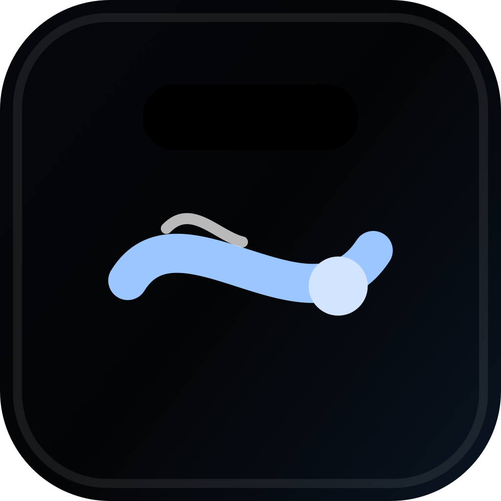

# NotchFlow

<p align="center">
  
</p>

<p align="center">
  NotchFlow 把 Mac 刘海变成紧凑的状态、媒体与快捷操作控制台。
</p>

<p align="center">
  <a href="https://aicode-nexus.github.io/NotchFlow/">中文官网</a>
  ·
  <a href="https://github.com/AICode-Nexus/NotchFlow/releases/latest">下载预览版</a>
  ·
  <a href="CHANGELOG.md">更新日志</a>
</p>

## 它能做什么

NotchFlow 是一款原生 macOS 刘海工具。它以菜单栏应用运行，不占用 Dock，在屏幕顶部以刘海形态悬浮，支持悬停展开、点击固定和全局快捷键。

第一个公开版本是面向 macOS 14 及更新系统的开发者预览版。

## 功能亮点

- 刘海形态悬浮面板：支持悬停展开、点击固定、自动隐藏和 `Option + Command + Space`。
- 媒体卡片：显示正在播放内容，并提供播放控制与 Music 兜底能力。
- 天气与电量模块：适合一眼查看，并在权限不足时优雅降级。
- 护眼与专注模块：统计活跃时长、连续专注时间、健康分和休息提醒。
- 剪贴板历史、快速启动、脚本快捷方式和壁纸刷新工具。
- 本地 Claude/Codex 使用日志的 AI token 用量摘要。
- 实验性充电限制控制，包含随包提供的 SMC helper。
- 设置窗口：管理外观、字号、模块、刷新间隔、启动行为与权限。

## 安装

1. 从最新 GitHub 发布页下载 `NotchFlow-v0.1.0-macOS.zip`。
2. 解压后把 `NotchFlow.app` 移动到 `/Applications`。
3. 如果 macOS 首次启动时提示应用暂未公证，请右键应用并选择 **打开**。
4. 只为你启用的功能授予权限，例如定位、自动化或登录时启动。

## 当前版本说明

`v0.1.0` 是第一个公开开发者预览版。它用于分发流程验证，当前为本地签名，还未使用 Apple Developer ID 公证。

已知限制：

- 部分集成依赖 macOS 权限和第三方应用可用性。
- WeatherKit 授权或定位权限不可用时，天气模块会进入兜底状态。
- 充电限制控制仍为实验功能，具体表现取决于硬件和 SMC 行为。
- 当前发布包为简单 `.zip`；后续计划提供已公证的 DMG 安装包。

完整版本记录见 [CHANGELOG.md](CHANGELOG.md)。

## 从源码构建

打开 Xcode 项目：

```bash
open NotchFlow.xcodeproj
```

运行测试：

```bash
swift test
```

构建 macOS 应用：

```bash
xcodebuild -project NotchFlow.xcodeproj -scheme NotchFlow -configuration Release build
```

Swift Package 入口仍可用于本地快速迭代：

```bash
swift run
```

## 项目维护

添加或删除 Swift 源文件后，重新生成 Xcode 项目：

```bash
ruby scripts/generate_xcodeproj.rb
```

重新生成发布图片资源和应用图标：

```bash
swift scripts/generate_release_assets.swift
```

## 研究资料

早期范围和竞品研究保留在：

- `research/competitors.md`
- `research/feature-list.md`
- `research/v1-scope.md`

## 许可

当前暂未声明开源许可。重新分发修改版构建前，请先联系仓库所有者。
